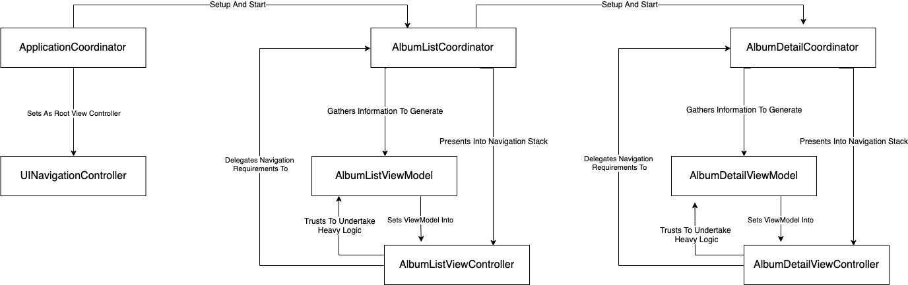

#  iTunesRSSFeedList

Simple iOS application that lists the top 100 albums of the iTunes endpoint. It presents a list of the albums and upon selecting a cell it presents a detail view controller with the detailed information of such album plus the ability to open the Apple Music detail page of the selected album.

## Technical Details

The application's UI is coded entirely programmatically using AutoLayout and custom UIObjects. It has a `Grid Generator` that can create stack views for any given model that creates its own `Grid Configuration` object.

The application uses no third party framework. Services for `networking`  and `image caching` have been created entirely locally using `URLSession` and `NSCache` with a protocol oriented approach. Network responses are handled using `Result` and custom errors have been created to properly represent the exact problem that might have occurred.

This and more is available on the sample codebase..

## Architecture

The application uses an `MVVM` architecture along with `Coordinators` for navigation. ViewModels help to extract heavy business logic from the View Controllers, it also eases testing as setting up VC for testing can be arduous. `Coordinators` solve the millenary problem of being able to reuse View Controllers. Each Coordinator owns its own VC and it is responsible for handling the upcoming navigation requirements, it also provides the `View Model` for the VC.  So it makes VC more reusable and untangles them from only being used on specific use cases.

## Application Architecture Diagram

